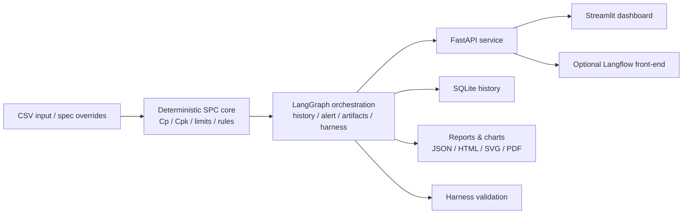

# Gear Quality SPC System

[](https://github.com/alexhuang-dev/gear-quality-spc-system/actions/workflows/tests.yml)


[](LICENSE)

[中文说明](README.zh-CN.md)

Gear Quality SPC System is a production-oriented backend for gear inspection quality analysis. It takes CSV measurement data, computes SPC results deterministically, compares them with historical runs, generates reports and charts, and validates the final output with a harness layer before you trust it.

What makes it different from a generic "AI workflow" project is the boundary it draws: the numbers live in code, while language-facing layers sit on top. Langflow is supported as a visual entry, but the system is designed to run without it.

## Architecture Overview



## Why You Might Care

If you are trying to turn inspection spreadsheets into something closer to an engineering system, this project is the middle ground between a one-off script and a full factory platform. It gives you deterministic SPC computation, traceable history, machine-checkable validation, and deployable service interfaces in one place.

## Technical Strengths

| Area | What is implemented | Why it matters |
|---|---|---|
| Deterministic computation | SPC metrics, control limits, historical deltas, and status grading are computed in Python | Core quality facts stay stable and auditable |
| Historical memory | SQLite-backed run storage and cross-run comparison | The system can say how the current batch changed, not just describe one snapshot |
| Validation layer | Harness checks and golden-case regression tests | Output quality is checked systematically instead of trusted by default |
| Multi-surface delivery | API, HTML reports, SVG charts, dashboard, and optional Langflow entry | The same backend can serve engineering use, reporting, and demos |
| Production shape | Auto-runner, webhook-ready alerts, Docker skeleton, CI test workflow | The project already behaves like something meant to leave the notebook stage |

## Quick Start

### Environment

- Python `3.11+`
- Windows PowerShell for the bundled scripts
- or Docker if you prefer container startup

### Local startup

```powershell
git clone https://github.com/alexhuang-dev/gear-quality-spc-system.git
cd gear-quality-spc-system
python -m venv .venv
.\.venv\Scripts\python -m pip install -r requirements.txt
powershell -ExecutionPolicy Bypass -File .\start_production_stack.ps1
```

After startup:

- API docs: [http://127.0.0.1:8000/docs](http://127.0.0.1:8000/docs)
- Ready check: [http://127.0.0.1:8000/ready](http://127.0.0.1:8000/ready)
- Dashboard: [http://127.0.0.1:8501](http://127.0.0.1:8501)

### Docker startup

```bash
cp .env.example .env
docker compose -f docker-compose.production.yml up --build -d
```

## How To Use It

### 1. Send a CSV to the API

Example request:

```powershell
$body = @{
  csv = @"
batch_no,time,part_id,metric_a,metric_b,defect_count
LOT001,2024-07-01 08:00,P001,12,4,0
LOT001,2024-07-01 08:05,P002,13,5,0
LOT001,2024-07-01 08:10,P003,14,6,1
LOT001,2024-07-01 08:15,P004,15,5,0
"@
  specs = @{
    metric_a = @{ USL = 20; LSL = 0 }
    metric_b = @{ USL = 10; LSL = 0 }
  }
} | ConvertTo-Json -Depth 6

Invoke-RestMethod `
  -Method Post `
  -Uri http://127.0.0.1:8000/analyze `
  -ContentType "application/json" `
  -Body $body
```

Example response shape:

```json
{
  "spc_result": {
    "run_id": "20260410090935_8b4fbe1a",
    "batch_numbers": ["LOT001"],
    "overall_min_cpk": 0.882,
    "overall_status": "warning"
  },
  "harness_eval": {
    "passed": true,
    "score": 1.0
  },
  "report_paths": {
    "html_report_path": "data/reports/report_20260410090935_8b4fbe1a.html"
  }
}
```

### 2. Drop CSV files into the watch directory

If the auto-runner is enabled, place CSV files in:

```text
data/incoming/
```

Processed files move to:

```text
data/processed/
```

### 3. Use the visual flow if you want a demo layer

Langflow is optional. If you want the showcase workflow:

- `New Flow - v9.3 api-frontend-prompt-merge-friendly.json`
- `langflow_integration/gear_spc_component.py`

## Project Structure

```text
api/                   FastAPI service entrypoints
core/                  SPC, history, charts, reports, alerts, harness logic
graph/                 LangGraph orchestration and deterministic fallback
harness/               golden-case helpers and regression support
services/              auto-runner for incoming CSV files
dashboard/             Streamlit dashboard
langflow_integration/  Langflow custom component and setup notes
tests/                 pytest coverage and golden fixtures
data/specs/            default specification configuration
```

## Why It Is Designed This Way

- Deterministic code owns SPC facts because those numbers need to stay stable across prompt changes.
- Langflow is kept outside the critical path because it is useful for demos but not a good system boundary.
- Harness validation is built into the project because report generation without consistency checks is not very convincing in an industrial setting.

## Known Limitations

- Default spec values are placeholders until replaced with real process standards.
- The repository does not include MES, ERP, or PLC integration.
- Alert delivery is webhook-ready, but real enterprise endpoints still need to be configured.
- PDF generation depends on the target host having the right rendering dependencies.

## Next Steps

- add more realistic production datasets and regression fixtures
- extend the dashboard from run summaries to operator-facing monitoring
- connect the alert layer to real enterprise notification channels
- expose the same backend through a cleaner LangGraph-native application boundary

## Testing

Run the current test suite with:

```powershell
.\.venv\Scripts\python -m pytest tests -q
```

## Additional Docs

- `PRODUCTION_DEPLOYMENT.md`
- `FINAL_ARCHITECTURE.md`
- `PROJECT_INTRO_BILINGUAL.md`
- `INTERVIEW_GUIDE.zh-CN.md`
- `SHOWCASE.md`
