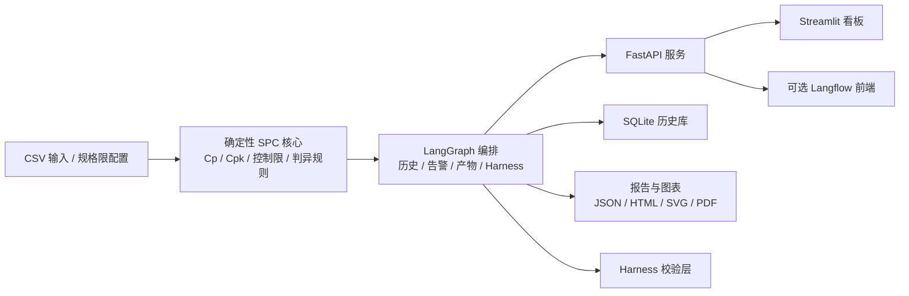

# 齿轮质量 SPC 系统

[](https://github.com/alexhuang-dev/gear-quality-spc-system/actions/workflows/tests.yml)


[](LICENSE)

[English](README.md)

齿轮质量 SPC 系统是一套面向齿轮检测场景的质量分析后端。它把 CSV 检测数据接进来，做确定性的 SPC 计算，接上历史批次对比，生成报告和图表，并在最后用 harness 去校验输出有没有把数字说歪。

它和常见“AI 工作流项目”的区别，不在于功能多一点，而在于边界划得更明确：数字和状态判断留在代码里，语言层放在上面。Langflow 可以接进来做展示，但系统不是靠 Langflow 才成立。

## 架构概览



## 这是什么，我为什么要关心

如果你面对的是一堆检测表格，想把它们从“人工看结果”往“工程化流程”推进一点，这个项目就是中间那一步。它不是完整工厂平台，但也不只是一次性脚本。它把确定性计算、历史记忆、结果校验、报告产物和服务接口收在了一套后端里。

## 技术优势

| 方向 | 现在做到什么 | 为什么有价值 |
|---|---|---|
| 确定性计算 | SPC 指标、控制限、历史差值、状态判断都在 Python 里完成 | 质量事实稳定、可复核，不会跟着提示词漂 |
| 历史记忆 | 基于 SQLite 保存运行记录并做跨批次对比 | 系统不是只看一批，而是能判断变化趋势 |
| 校验层 | Harness 检查 + golden case 回归测试 | 输出不是“看起来像对”，而是有一层机器校验 |
| 多形态输出 | API、HTML 报告、SVG 图表、Dashboard、可选 Langflow 入口 | 同一套后端既能给工程使用，也能拿来展示 |
| 生产形态 | 自动处理、告警载荷、Docker 骨架、CI 测试工作流 | 这个仓库已经有了走向真实部署的基本样子 |

## 怎么跑起来

### 环境要求

- Python `3.11+`
- Windows PowerShell（仓库里自带启动脚本）
- 或者 Docker

### 本地启动

```powershell
git clone https://github.com/alexhuang-dev/gear-quality-spc-system.git
cd gear-quality-spc-system
python -m venv .venv
.\.venv\Scripts\python -m pip install -r requirements.txt
powershell -ExecutionPolicy Bypass -File .\start_production_stack.ps1
```

启动后可以访问：

- API 文档：[http://127.0.0.1:8000/docs](http://127.0.0.1:8000/docs)
- 就绪检查：[http://127.0.0.1:8000/ready](http://127.0.0.1:8000/ready)
- Dashboard：[http://127.0.0.1:8501](http://127.0.0.1:8501)

### Docker 启动

```bash
cp .env.example .env
docker compose -f docker-compose.production.yml up --build -d
```

## 怎么用

### 1. 把 CSV 发给 API

示例请求：

```powershell
$body = @{
  csv = @"
batch_no,time,part_id,metric_a,metric_b,defect_count
LOT001,2024-07-01 08:00,P001,12,4,0
LOT001,2024-07-01 08:05,P002,13,5,0
LOT001,2024-07-01 08:10,P003,14,6,1
LOT001,2024-07-01 08:15,P004,15,5,0
"@
  specs = @{
    metric_a = @{ USL = 20; LSL = 0 }
    metric_b = @{ USL = 10; LSL = 0 }
  }
} | ConvertTo-Json -Depth 6

Invoke-RestMethod `
  -Method Post `
  -Uri http://127.0.0.1:8000/analyze `
  -ContentType "application/json" `
  -Body $body
```

返回结果大致长这样：

```json
{
  "spc_result": {
    "run_id": "20260410090935_8b4fbe1a",
    "batch_numbers": ["LOT001"],
    "overall_min_cpk": 0.882,
    "overall_status": "warning"
  },
  "harness_eval": {
    "passed": true,
    "score": 1.0
  },
  "report_paths": {
    "html_report_path": "data/reports/report_20260410090935_8b4fbe1a.html"
  }
}
```

### 2. 直接丢文件到监听目录

如果 auto-runner 在运行，把 CSV 放到：

```text
data/incoming/
```

处理完成后会移到：

```text
data/processed/
```

### 3. 需要演示工作流时再接 Langflow

如果你想用可视化工作流入口：

- `New Flow - v9.3 api-frontend-prompt-merge-friendly.json`
- `langflow_integration/gear_spc_component.py`

## 项目结构是什么

```text
api/                   FastAPI 服务入口
core/                  SPC、历史、图表、报告、告警、harness 逻辑
graph/                 LangGraph 编排层和确定性回退
harness/               黄金样本与回归辅助
services/              自动处理服务
dashboard/             Streamlit 看板
langflow_integration/  Langflow 自定义组件和接入说明
tests/                 pytest 测试和黄金样本
data/specs/            默认规格限配置
```

## 为什么这样设计

- 确定性的质量事实留在代码里，因为这些东西不能跟着提示词飘。
- Langflow 放在系统边缘，因为它适合演示，不适合当事实边界。
- harness 从一开始就放进来，因为能生成报告不代表结果可信，可信度要靠校验层。

## 已知限制

- 默认规格限只是占位值，真正使用前要替换成现场标准。
- 仓库本身不包含 MES、ERP、PLC 的对接逻辑。
- 告警层已经能生成 webhook 载荷，但真实企业地址需要现场配置。
- PDF 生成功能依赖目标机器上的渲染环境。

## 下一步计划

- 补更多更接近生产的测试数据和回归样本
- 把 dashboard 从结果展示再往监控方向推进
- 把告警层接到真实企业通知通道
- 把后端进一步整理成更清晰的 LangGraph 原生应用边界

## 测试

运行测试：

```powershell
.\.venv\Scripts\python -m pytest tests -q
```

## 相关文档

- `PRODUCTION_DEPLOYMENT.md`
- `FINAL_ARCHITECTURE.md`
- `PROJECT_INTRO_BILINGUAL.md`
- `INTERVIEW_GUIDE.zh-CN.md`
- `SHOWCASE.md`
